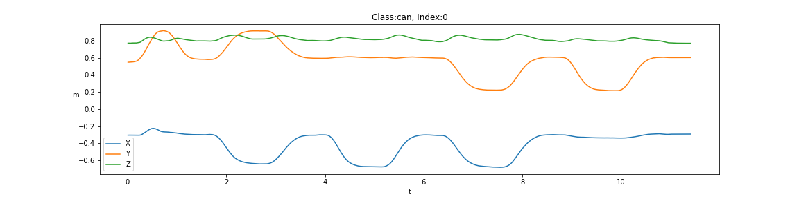
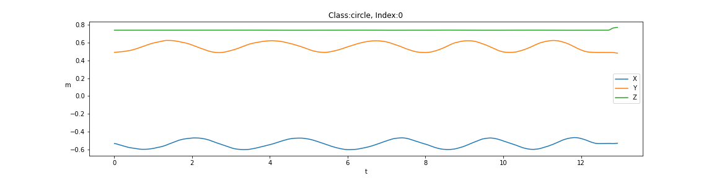
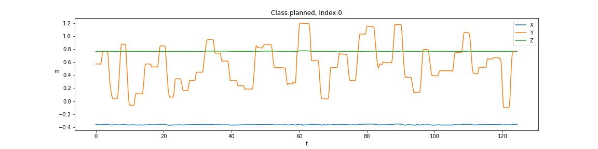

# ComplexUpper-LimbMovements

## Intro
Analisys of the ComplexUpper-LimbMovements dataset with application of some classification algorithms.

## Dataset Description
The Complex Upper-Limb Movements database contains hand trajectory data collected from ten subjects as they performed various upper-limb motor tasks.
The csv data files contain four columns. The data in the first column is the time axis in seconds. The data samples in the other three columns are the x-, y-, and z-coordinates of the reflective marker utilized in each experiment to represent the hand trajectory of movement. The data is reported in meters. Different files contain data pertaining to different subjects for different motor tasks.

Actions: ['BostonCA', 'BostonCU', 'HarvardCA', 'HarvardCU', 'Can', 'Circle', 'Ellipse', 'Flower', 'Spiral', 'SuperMegaCloud', 'Triangle', 'Planned', 'Unplanned', 'Randomness'] 

## Dataset Visualization
Some action visualization:

## Preprocessing
The dataset is divided in windows of lenght TIME_STEPS and with a step of lenght STEP. 
There are two path followed: 
  * These windows are feed to some Deep neural networks or 
  * A feature extraction algorithm is run to extract from the windows some important information: [mean, median, std, minv, maxv, percentile25, p50, p75, sum, energy, skewness, kurt]

## Training
Different training processes were employed depending on the preprocessing path:
* Different Deep neural network were tested (Fully Connected Network, simple LSTM, bidirectional LSTM, Conv LSTM, ...)
* Different non-Deep classifier were tested (Random Forest, SVM, LDA, QDA, ...). 

## Results
* For the DNN: the best performances in accuracy were reached with the model **Conv LSTM** with an accuracy on the test set of: 0.000 (using as TIME_STEPS=128 and STEP=96);
* For the Non-DNN: the best performances in accuracy were reached with the **Random Forest Classifier** with an accuracy on the test set of: 0.000 (using as n_estimators=256, max_depth=None);

Reference: [link](https://physionet.org/content/culm/1.0.0/)
